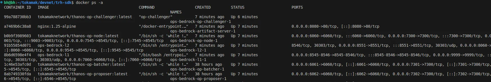

# Devnet

A **Devnet** (Development Network) serves as a local testing environment that allows developers to experiment, validate configurations, and simulate rollup deployments without interacting with public networks. It provides a safe and cost-effective way to test appchain logic, integration modules and SDK commands in a controlled setting. Using a Devnet helps identify issues early in the development lifecycle, ensuring smoother deployments to Testnet or Mainnet later.

### Deployment Steps

Proceed with the instructions below to deploy a Devnet according to your chosen deployment method:


1. First, create a folder for your deployment with the following command.

```bash
mkdir trh-devnet
cd trh-devnet
```

2. You can now deploy the devnet by running the following command. The SDK will handle repository cloning, dependency installation, and chain initialization.

```bash
trh-sdk deploy
```

3. If you successfully deploy the local-devnet, you will get the following output:

```bash
...
Container ops-bedrock-l1-1  Running
Container ops-bedrock-artifact-server-1  Creating
Container ops-bedrock-l2-1  Running
Container ops-bedrock-op-node-1  Creating
Container ops-bedrock-op-node-1  Created
Container ops-bedrock-op-batcher-1  Creating
Container ops-bedrock-op-proposer-1  Creating
Container ops-bedrock-artifact-server-1  Created
Container ops-bedrock-op-batcher-1  Created
Container ops-bedrock-op-proposer-1  Created
Container ops-bedrock-op-node-1  Starting
Container ops-bedrock-artifact-server-1  Starting
Container ops-bedrock-artifact-server-1  Started
Container ops-bedrock-op-node-1  Started
Container ops-bedrock-op-proposer-1  Starting
Container ops-bedrock-op-batcher-1  Starting
Container ops-bedrock-op-batcher-1  Started
Container ops-bedrock-op-proposer-1  Started
✅ Devnet started successfully! 
```

4. Use the `docker ps` command to verify that the containers are up and running. A successful installation will produce the following output.

<figure><figcaption><p>Docker Containers</p></figcaption></figure>

> ℹ️ Once the Devnet is deployed, you can manage and operate it using this guide. [devnet.md](../operation-guide/devnet.md "mention")

5. You can run the following commands in deployment folder to **destroy** the devnet.

```bash
trh-sdk destroy
```

6. If the local devnet is successfully destroyed, you will see the following output. You can also verify by running `docker ps` to check the container status.

```bash
✅ Devnet network destroyed successfully! 
```

