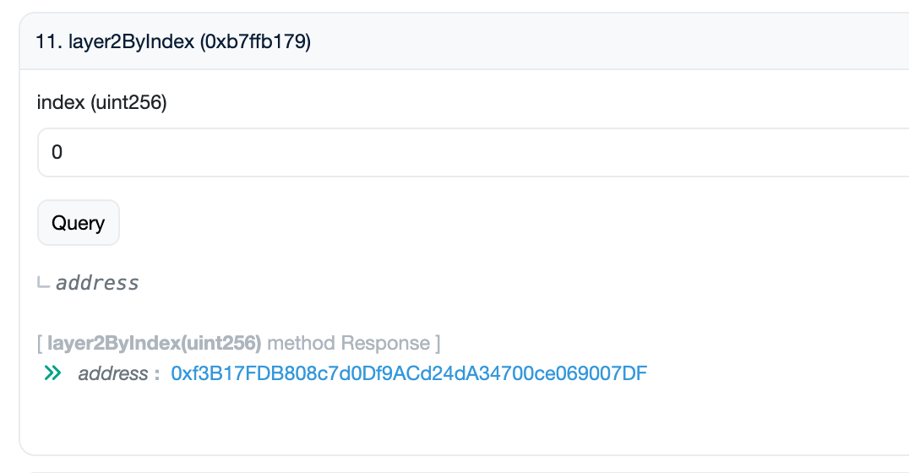
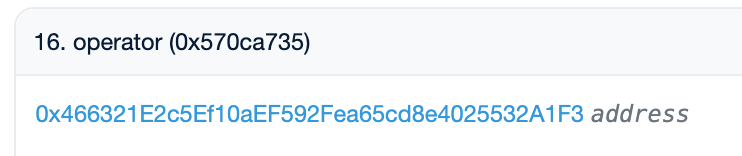
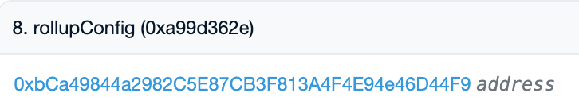

# 운영자(operator) 정보 확인하기

운영자(DAO 후보자)는 **Layer2Registry** 컨트랙트에 등록되어 있습니다. 이 컨트랙트를 통해 각 운영자의 Candidate 컨트랙트, 운영자 관리자(operator manager), 그리고 L2 시퀀서의 경우 롤업(rollup) 및 브리지(bridge) 상세 정보까지 확인할 수 있습니다.

* Layer2Registry: [0x7846c2248a7b4de77e9c2bae7fbb93bfc286837b](https://etherscan.io/address/0x7846c2248a7b4de77e9c2bae7fbb93bfc286837b)
* Layer2Manager: [0xD6Bf6B2b7553c8064Ba763AD6989829060FdFC1D](https://etherscan.io/address/0xD6Bf6B2b7553c8064Ba763AD6989829060FdFC1D)
* SeigManager: [0x0b55a0f463b6defb81c6063973763951712d0e5f](https://etherscan.io/address/0x0b55a0f463b6defb81c6063973763951712d0e5f)
* WTON: [0xc4A11aaf6ea915Ed7Ac194161d2fC9384F15bff2](https://etherscan.io/address/0xc4A11aaf6ea915Ed7Ac194161d2fC9384F15bff2)

## 운영자 조회하기

### `numLayer2s()`

등록된 Layer2 운영자(네트워크)의 [전체 수](https://etherscan.io/address/0x7846c2248a7b4de77e9c2bae7fbb93bfc286837b#readProxyContract)를 반환합니다.

* **반환값**: `uint256` — 등록된 운영자 수

### `layer2ByIndex(uint256 index)`

인덱스로 [등록된 운영자의 주소](https://etherscan.io/address/0x7846c2248a7b4de77e9c2bae7fbb93bfc286837b#readProxyContract)를 조회합니다.

* **파라미터**: `index` (0부터 시작)
* **반환값**: `address` — 해당 인덱스의 `candidateContract` 주소

<figure><figcaption>
반환된 주소를 열면 Candidate 컨트랙트로 이동합니다
</figcaption></figure>

## Candidate 컨트랙트 확인하기

위에서 반환된 `candidateContract` 주소를 열고, **Read as Proxy** 탭을 사용합니다.

### `memo()`

운영자의 이름 / 메모입니다. 원하는 운영자가 맞는지 확인할 때 활용합니다.

* **반환값**: `string` — 운영자 이름 또는 메모

### `stakedOf(address user)`

특정 사용자가 이 운영자에게 스테이킹한 수량을 조회합니다.

* **파라미터**: `user` (조회할 주소)
* **반환값**: `uint256` — 해당 사용자가 스테이킹한 수량

### `totalStaked()`

이 운영자에게 스테이킹된 총 수량을 반환합니다.

* **반환값**: `uint256` — 운영자에게 스테이킹된 총 수량

### `operator()`

운영자 관리자(operator manager) 컨트랙트 주소를 반환합니다.

* **반환값**: `address` — 운영자 관리자 컨트랙트(`operatorManager`) 주소

<figure><figcaption>
operatorManager 주소를 확인합니다
</figcaption></figure>

## 운영자 관리자 확인하기 (L2 시퀀서)

`operatorManager` 주소를 열고, **Read as Proxy** 탭을 사용합니다.

### `rollupConfig()`

운영자의 RollupConfig 컨트랙트 주소를 반환합니다.

* **반환값**: `address` — RollupConfig 컨트랙트 주소

<figure><figcaption>
rollupConfig 주소를 확인합니다
</figcaption></figure>

### `checkL1BridgeDetail(address rollupConfigAddress)` — Layer2Manager에서 호출

롤업의 [L1 브리지 상세 정보를 조회](https://etherscan.io/address/0xD6Bf6B2b7553c8064Ba763AD6989829060FdFC1D#readProxyContract)합니다.

* **파라미터**: `rollupConfigAddress` — RollupConfig 컨트랙트 주소
* **반환값**: `array` — L1 브리지 상세 정보. 인덱스 5의 값이 `1`이면 해당 운영자는 L2 운영자입니다. L2 운영자가 아닌 경우 아래 조회 항목은 사용할 수 없습니다.

### `optimismPortal()` — RollupConfig에서 호출

L2 브리지(Optimism Portal) 주소를 반환합니다.

* **반환값**: `address` — L2 브리지 주소

## L2 시퀀서 시뇨리지(seigniorage)

L2 시퀀서가 현재 받을 수 있는 시뇨리지는 운영자 관리자가 보유한 WTON 잔액에 `estimatedDistribute`의 반환값을 더한 금액입니다.

### `balanceOf(address account)` — WTON에서 호출

운영자 관리자 컨트랙트가 보유한 WTON 잔액을 조회합니다.

* **파라미터**: `account` — `operatorManager` 주소
* **반환값**: `uint256` — 운영자 관리자의 잔액

### `estimatedDistribute(uint256 blockNumber, address opAddress)` — SeigManager에서 호출

다음 블록에 대한 [예상 시뇨리지 분배량](https://etherscan.io/address/0x0b55a0f463b6defb81c6063973763951712d0e5f#readProxyContract)을 조회합니다.

* **파라미터**
  * `blockNumber`: 현재 블록 번호 + 1
  * `opAddress`: `candidateContract` 주소 (`layer2ByIndex`에서 반환된 값)
* **반환값**: `array` — 분배 정보. 인덱스 7이 추가로 분배될 WTON 수량입니다
