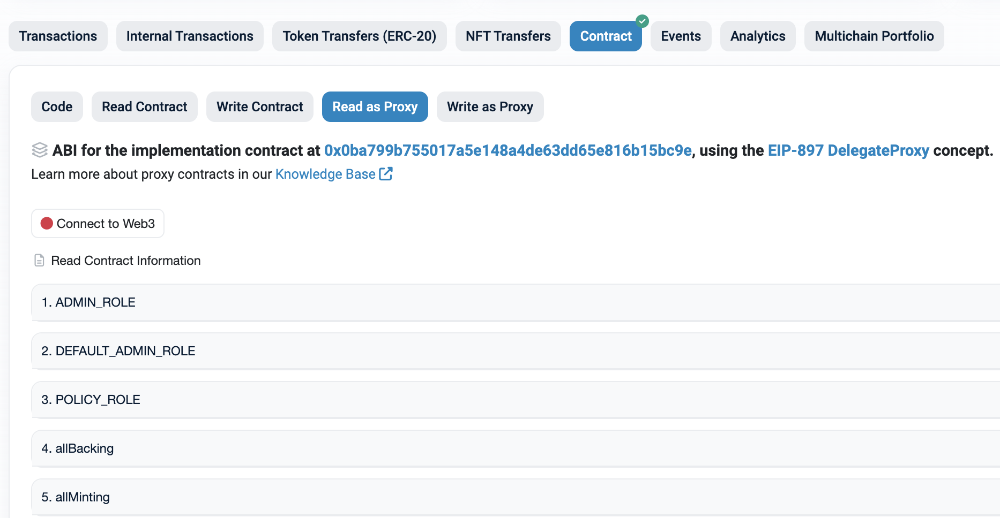
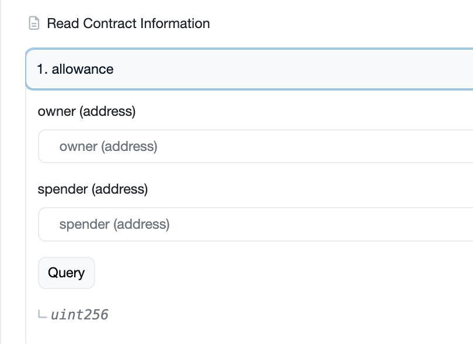
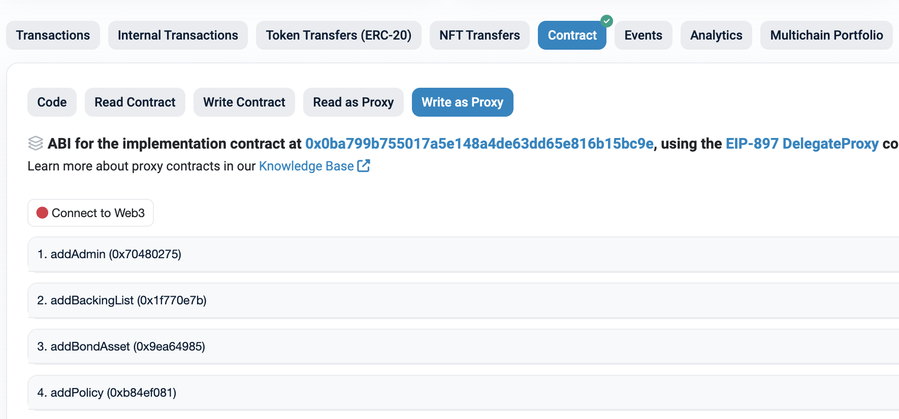
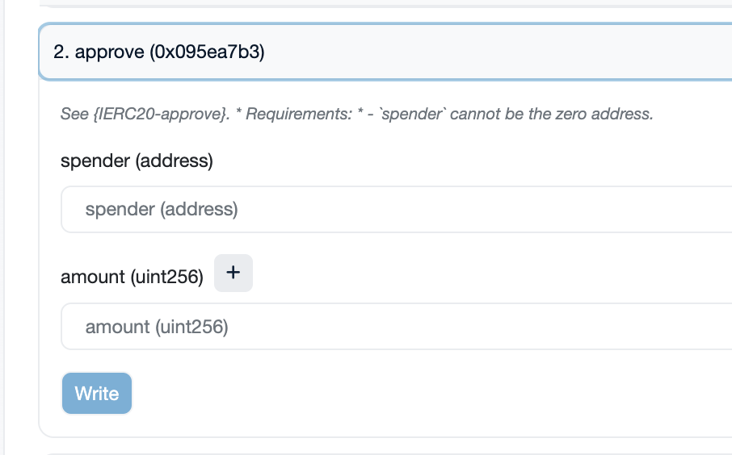

# Interact via Etherscan

Because the official staking website is no longer hosted, the most reliable way to use staking is to call the contract functions directly on Etherscan. You connect your wallet on Etherscan, then use the **Read** tabs to query information and the **Write** tabs to send transactions.


You can request support through [GitHub issues](https://github.com/tokamak-network/TokamakStaking/issues).


### Overall usage flow

1. **Preparation** — Prepare your wallet (e.g., MetaMask) and your TON/WTON tokens. See [Contract addresses](contract-addresses.md) for every address referenced in this guide.
2. **Staking** — Stake TON or WTON with the `approveAndCall` function. See [Stake via Etherscan](stake-via-etherscan.md).
3. **Unstaking / withdrawal request** — Unstake and request a withdrawal with `requestWithdrawal`, then complete it with `processRequests`. See [Unstake, restake & withdraw via Etherscan](unstake-restake-withdraw-via-etherscan.md).
4. **Restaking** — Restake pending withdrawals with `redepositMulti`. See [Unstake, restake & withdraw via Etherscan](unstake-restake-withdraw-via-etherscan.md).
5. **Operator / L2 information** — Look up operators and L2 sequencer details. See [Check operator information](check-operator-information.md).

### Executing queries (Read)

On a contract's **Read Contract** or **Read as Proxy** tab you can see the functions available for querying. Enter the parameters for the function you want and click the query button to view the result.

<figure><figcaption>
Read as Proxy view
</figcaption></figure>

When a function requires parameters, an input field appears as shown below. Enter the parameters and run the query.

<figure><figcaption>
Querying with parameters
</figcaption></figure>

### Executing transactions (Write)

To send a transaction, first connect your wallet at the top of the page ("Connect to Web3").

On a contract's **Write Contract** or **Write as Proxy** tab you can see the functions that send transactions. Enter the parameters for the function you want and click **Write** to execute it.

<figure><figcaption>
Write as Proxy view
</figcaption></figure>

When a transaction requires parameters, an input field appears as shown below. Enter the parameters and click **Write**.

<figure><figcaption>
Writing with parameters
</figcaption></figure>


Token amounts use different units depending on the token:

* **TON** uses 18 decimals (Wei).
* **WTON** and amounts on the DepositManager/SeigManager use 27 decimals (Ray).

Double-check the unit a function expects before entering an amount.

