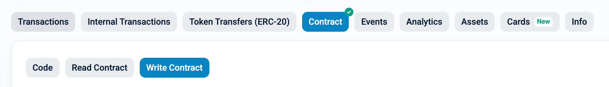

# Stake via Etherscan

You can stake TON through the **TON** contract, or stake WTON through the **WTON** contract. In both cases, `approveAndCall` handles the approval and the staking in a single transaction, so no separate `approve` is required.

* TON contract (Write): [0x2be5e8c109e2197D077D13A82dAead6a9b3433C5](https://etherscan.io/address/0x2be5e8c109e2197D077D13A82dAead6a9b3433C5#writeContract)
* WTON contract (Write): [0xc4A11aaf6ea915Ed7Ac194161d2fC9384F15bff2](https://etherscan.io/address/0xc4A11aaf6ea915Ed7Ac194161d2fC9384F15bff2#writeContract)

<figure><figcaption><p>The available functions appear on the Write tab of the contract</p></figcaption></figure>

## Stake TON — `approveAndCall`

[`approveAndCall(address spender, uint256 amount, bytes data)`](https://etherscan.io/address/0x2be5e8c109e2197D077D13A82dAead6a9b3433C5#writeContract) — approves TON to the staking contract and stakes it to the chosen layer2 operator in one transaction.

* **Parameters**
  * `spender`: the WTON address `0xc4A11aaf6ea915Ed7Ac194161d2fC9384F15bff2`
  * `amount`: amount of TON to stake (18 decimals, Wei)
  * `data`: the DepositManager address concatenated with the operator address you are staking to, each padded to 32 bytes

**About the `data` parameter**

* `data` is the DepositManager address (`0x0b58ca72b12f01fc05f8f252e226f3e2089bd00e`, fixed) followed by the operator address you want to stake to (variable), each encoded as 32 bytes.
* The DepositManager address never changes; only the operator address changes.
* Example (operator `0xF078AE62eA4740E19ddf6c0c5e17Ecdb820BbEe1`):

```
0x0000000000000000000000000b58ca72b12f01fc05f8f252e226f3e2089bd00e000000000000000000000000F078AE62eA4740E19ddf6c0c5e17Ecdb820BbEe1
```

* First 32 bytes: DepositManager address
* Last 32 bytes: operator address to stake to

> To stake to a different operator, change only the operator portion of `data`.

## Stake WTON

You can stake WTON in two ways.

### Option 1 — `approveAndCall`

[`approveAndCall(address spender, uint256 amount, bytes data)`](https://etherscan.io/address/0xc4A11aaf6ea915Ed7Ac194161d2fC9384F15bff2#writeContract) — approves WTON and stakes it to the chosen operator in one transaction.

* **Parameters**
  * `spender`: the DepositManager address `0x0b58ca72b12f01fc05f8f252e226f3e2089bd00e`
  * `amount`: amount of WTON to stake (27 decimals, Ray)
  * `data`: the operator address to stake to, encoded as 32 bytes

**About the `data` parameter**

* `data` is just the operator address (variable), encoded as 32 bytes.
* Example (operator `0xF078AE62eA4740E19ddf6c0c5e17Ecdb820BbEe1`):

```
0x000000000000000000000000F078AE62eA4740E19ddf6c0c5e17Ecdb820BbEe1
```

### Option 2 — `approve` then `deposit`

Running `approve` and `deposit` as two separate transactions can be cheaper in gas.

1. [`approve(address spender, uint256 amount)`](https://etherscan.io/address/0xc4A11aaf6ea915Ed7Ac194161d2fC9384F15bff2#writeContract) on the WTON contract
   * `spender`: DepositManager address `0x0b58ca72b12f01fc05f8f252e226f3e2089bd00e`
   * `amount`: amount of WTON to stake (27 decimals, Ray)
2. [`deposit(address layer2, uint256 amount)`](https://etherscan.io/address/0x0b58ca72b12f01fc05f8f252e226f3e2089bd00e#writeProxyContract) on the DepositManager (Write as Proxy)
   * `layer2`: operator address to stake to
   * `amount`: amount of WTON to stake (27 decimals, Ray)


Not sure which operator address to use? See [Check operator information](check-operator-information.md) to look up registered operators and confirm the one you want.

