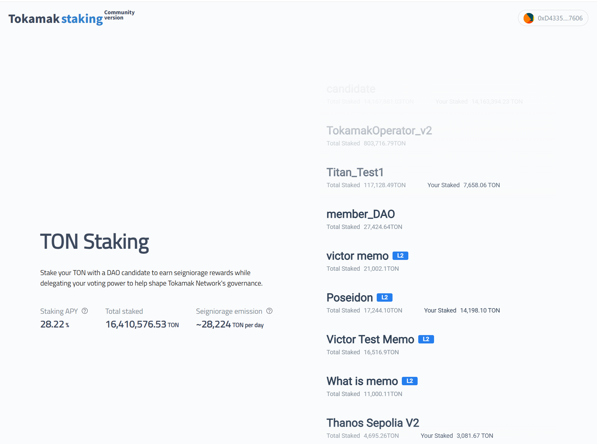
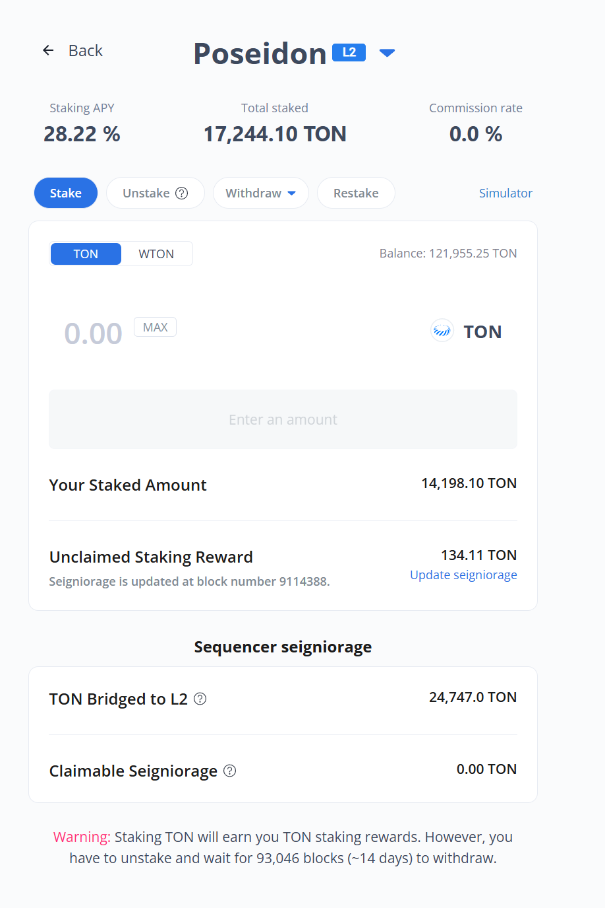
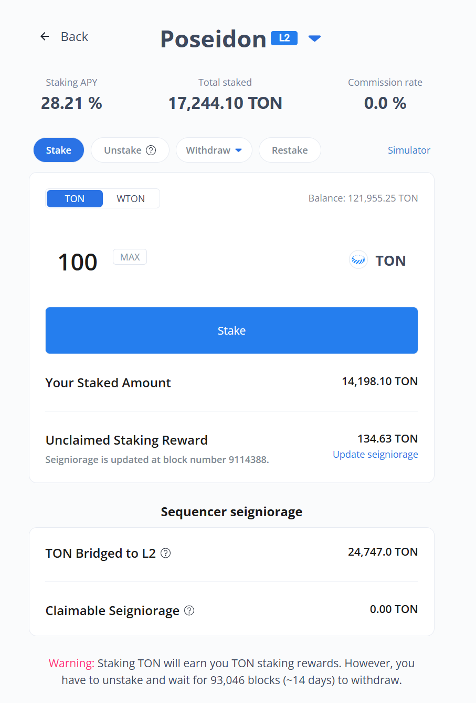

# Stake

### **1. DAO 후보자**

DAO 후보자 목록에서 톤을 스테이킹하기 위해, 우측 펼치기 버튼을 클릭하여 상세정보를 파악합니다.

<figure><figcaption></figcaption></figure>

### **2.  스테이킹 정보**

상세정보창이 확장되어 나타나면, 해당 DAO 후보자의 정보를 확인합니다.


* Stakers: DAO 후보자에게 스테이킹 한 유저의 수
* Pending Withdrawal: 스테이크 해제(unstake)를 실행한 후, 인출(withdrawal) 하지 않은 물량 합계
* Your Staked: 지금 선택된 DAO 후보자에게 스테이킹한 물량
* Unclaimed Staking Reward: 스테이킹 한 이후, 시간경과에 따른 스테이킹 보상이 발생했으나 아직까지 클레임(claim)하여 가져가지는 않은 물량
* 만약 선택한 DAO 후보가 L2 시퀀서라면 Sequencer seigniorage 와 관련된 정보를 확인할 수 있습니다. 여기서 확인할 수 있는 정보는 다음과 같습니다.
  * 해당 L2에 브릿지된 TON 수량
  * L2 시퀀서가 클레임 할 수 있는 TON 수량


<figure><figcaption></figcaption></figure>

### **3. 스테이킹**

<figure><figcaption></figcaption></figure>

&#x20;

**스테이킹 방법:**

* 보유하고 있는 TON 또는 WTON 토큰으로 스테이킹할 수 있습니다.
* TON을 선택하면 Balance에 사용 가능한 TON 수량이 표시됩니다.
* WTON을 선택하면 Balance에 사용 가능한 WTON 수량이 표시됩니다.
* Max 버튼을 클릭하면 스테이킹 가능한 최대 수량이 입력됩니다 (예: 이미지에 표시된 121,955.25 TON)

**스테이킹 확인:**

* 수량 입력 후, 모든 내용이 정확하다면 버튼이 "Stake"로 변경됩니다.
* Stake 버튼을 클릭하여 스테이킹 트랜잭션을 실행합니다.
* Stake 버튼을 누르면, 브라우저의 메타마스크 확장 프로그램에서 열리는 메타마스크 팝업창이 나옵니다. 컨펌을 클릭하여 스테이킹을 완료합니다.&#x20;

<figure><figcaption>
메타마스크(MetaMask) 창
</figcaption></figure>


Stake 버튼이 비활성화 된 경우

* 해당 DAO 후보자가 1,000.1 TON을 스테이킹 하지 않아서 발생하는 현상입니다 (collateral 미제공시).

