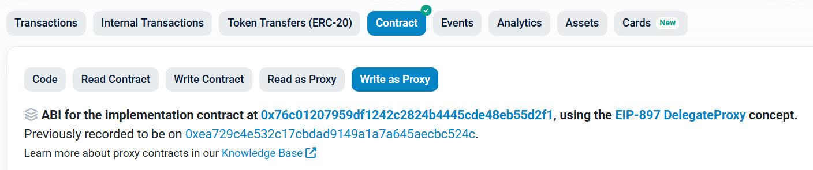

# Unstake, restake & withdraw via Etherscan

All of these actions go through the **DepositManager** contract.

* DepositManager (Write as Proxy): [0x0b58ca72b12f01fc05f8f252e226f3e2089bd00e](https://etherscan.io/address/0x0b58ca72b12f01fc05f8f252e226f3e2089bd00e#writeProxyContract)
* DepositManager (Read as Proxy): [0x0b58ca72b12f01fc05f8f252e226f3e2089bd00e](https://etherscan.io/address/0x0b58ca72b12f01fc05f8f252e226f3e2089bd00e#readProxyContract)

<figure><figcaption>
The functions appear on the Write as Proxy tab of the DepositManager
</figcaption></figure>

### Overall flow

1. **Withdrawal request (unstake)** — `requestWithdrawal`
2. **Restake (optional)** — `redepositMulti`
3. **Withdraw** — `processRequests`, once the pending period has passed


A withdrawal is only available after the withdrawal delay period (default **93,046 blocks**, roughly **14 days**) has passed since the request. After `requestWithdrawal`, you must still run `processRequests` to actually receive your tokens — waiting alone does not move the funds.


## Write functions

### `requestWithdrawal(address layer2, uint256 amount)`

[Request a withdrawal](https://etherscan.io/address/0x0b58ca72b12f01fc05f8f252e226f3e2089bd00e#writeProxyContract) of your staked amount (unstake).

* **Parameters**
  * `layer2`: operator address to withdraw from
  * `amount`: amount to withdraw (27 decimals, Ray)

> Each call to `requestWithdrawal` is tracked as **one request**, regardless of the amount. Whether you unstake 100 TON or 1,000 TON, each call counts as a single withdrawal request.

### `redepositMulti(address layer2, uint256 n)`

[Restake](https://etherscan.io/address/0x0b58ca72b12f01fc05f8f252e226f3e2089bd00e#writeProxyContract) pending (not-yet-withdrawn) requests back into staking.

* **Parameters**
  * `layer2`: operator address to restake to
  * `n`: number of pending requests to restake

### `processRequests(address layer2, uint256 n, bool receiveTON)`

[Withdraw](https://etherscan.io/address/0x0b58ca72b12f01fc05f8f252e226f3e2089bd00e#writeProxyContract) requests whose pending period has passed.

* **Parameters**
  * `layer2`: operator address to withdraw TON from
  * `n`: number of requests to process
  * `receiveTON`: `true` to receive TON, `false` to receive WTON

## Read functions

Use the **Read as Proxy** tab of the DepositManager to inspect your requests before restaking or withdrawing.

### `numPendingRequests(address layer2, address account)`

Number of pending (not-yet-processed) withdrawal requests for an account on an operator.

* **Parameters**: `layer2` (operator), `account` (user address)
* **Returns**: `uint256` — number of pending requests

### `numRequests(address layer2, address account)`

Total number of withdrawal requests an account has created for an operator.

* **Parameters**: `layer2` (operator), `account` (user address)
* **Returns**: `uint256` — total number of requests

### `withdrawalRequest(address layer2, address account, uint256 index)`

Details of a specific withdrawal request.

* **Parameters**: `layer2` (operator), `account` (user address), `index` (request index, starting at 0)
* **Returns**
  * `withdrawableBlockNumber`: block number when the withdrawal becomes available (e.g., `22579548`)
  * `amount`: amount requested at this index (Ray, e.g., `10000000000000000000000000000`)
  * `processed`: whether this request has already been withdrawn or restaked


To restake or withdraw, you only need to look at the currently pending requests. Check the total with `numRequests()`, then inspect `withdrawalRequest` from the highest index downwards (e.g., if `numRequests` returns 4, check index 3, 2, 1, …).

A request is eligible for withdrawal when its `withdrawableBlockNumber` is below the current block and `processed` is `false`. If one such request exists, set `n = 1` in `processRequests`; if two exist, set `n = 2`, and so on. When several are eligible, the **earliest** one is processed first — you cannot target a specific index.

