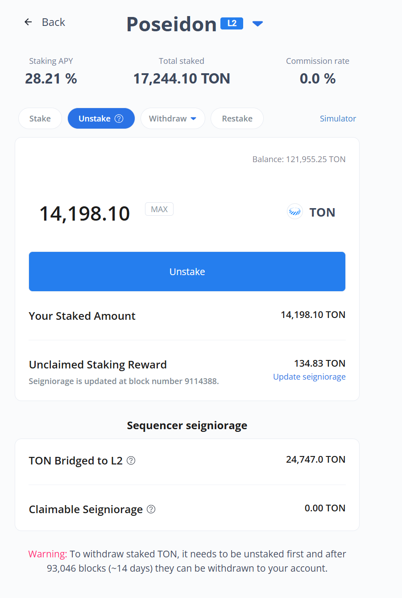
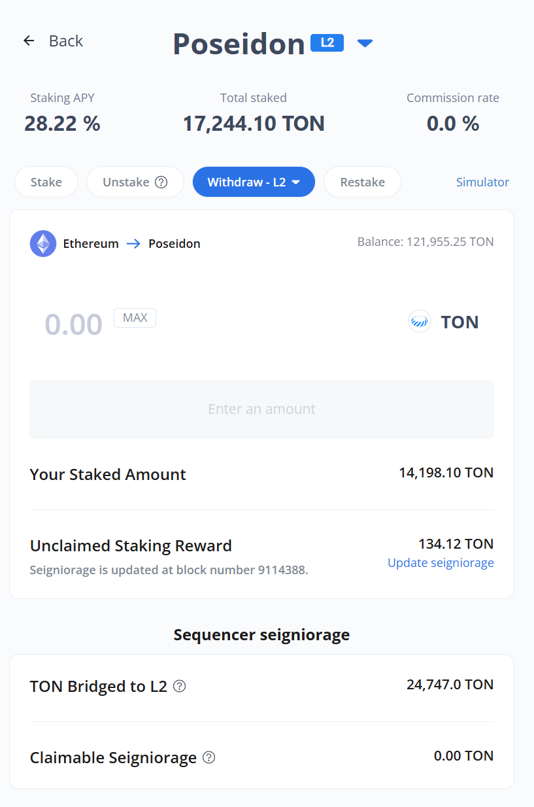
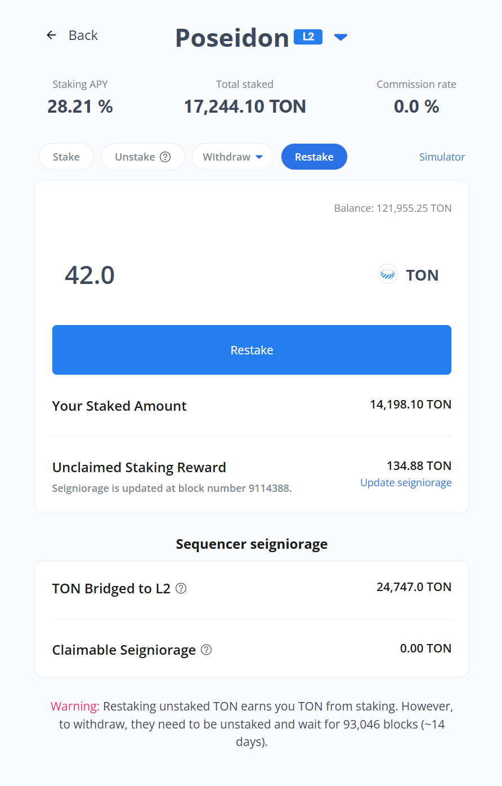

# Withdraw

There are two key points to note. First, withdrawing the staked amount requires two steps: unstaking and then withdrawing. Second, withdrawal is only possible after 93,046 blocks from unstaking (approximately 14 days).


Withdrawal delay period

* Period: 93,046 blocks after unstaking (approximately equivalent to 14 days).

Sometimes, users say that even after waiting about two weeks (Withdrawal delay period), they haven't received their tokens. This problem usually happens when they forget to click the withdraw button after the unstaking period is over.


### &#x20;1. Unstake

<figure><figcaption></figcaption></figure>

**What is Unstake:**

* **Unstake** is the process to withdraw L1 staked amounts
* **Do NOT use Unstake** if you want to withdraw to L2 - use Withdraw-L2 instead
* **Maximum amount** you can input in Unstake is limited to your "Your Staked Amount"

**How to Unstake:**

1. Click the **Unstake button** on your staking position
2. **Enter the amount** you want to unstake
3. **Confirm the transaction** in your wallet
4. Click the confirm button in the Metamask popup that opens in the Metamask extension of the browser.&#x20;


Before unstaking, check if there are any unclaimed staking rewards

* After unstaking, any unclaimed staking rewards will be burned.
* If there are unclaimed rewards, claim them to Your Staked first


### &#x20;2. Withdraw

**Option 1: L1 Withdrawal (Standard)**

<figure><figcaption></figcaption></figure>

1. **Click the withdraw button** on your staking position
2. **Select L1 withdrawal** for standard Ethereum network
3. **Choose token** to withdraw - select TON to receive TON, select WTON to receive WTON
4. **Available withdrawal amount** is automatically calculated and filled in
5. **Confirm transaction** in your wallet

**Option 2: L2 Withdrawal (If Available)**

<figure><figcaption></figcaption></figure>

**What is L2 Withdrawal:** L2 Withdrawal allows you to withdraw TON staked to an L2 network (e.g., Poseidon in the image above) where your operator acts as a sequencer. While L1 Withdrawals take about 2 weeks, L2 Withdrawals only require waiting for the L2 network to process the deposited amount.

**How to Withdraw to L2:**

1. **Select L2 withdrawal** if your operator supports it
2. **Choose withdrawal amount**
3. **Confirm the transaction**
4. **Wait for L2 processing** before funds are available

### **3. Restake**

After unstaking, you can restake at any time, provided you haven't made the withdrawal. The pending withdrawal amount will be displayed as 'Restakable Amount' in the pop-up window when you click the Restake button.

<figure><figcaption></figcaption></figure>

**How to Restake:**

1. **Check the pending amount** after unstaking
2. **Click Restake** to confirm
3. **Confirm the transaction** in your wallet
