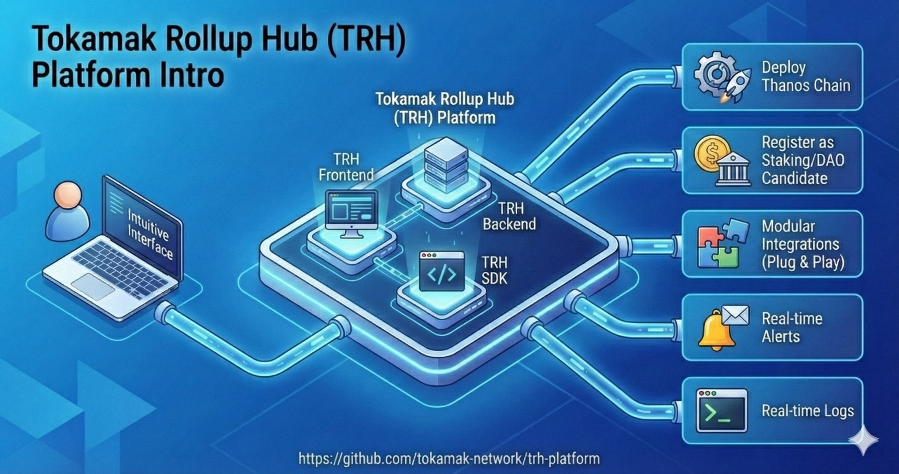

# Introduction

<figure><figcaption></figcaption></figure>

The **Tokamak Rollup Hub (TRH) Platform** provides an intuitive, user-friendly interface that allows users to seamlessly deploy their own chains and access the full range of functionalities offered by the Tokamak Rollup Hub SDK. These include :

1. Deploy a chain based on Thanos stack, with option to perform advanced customization.
2. Register the deployed chain as a staking/DAO candidate to earn seigniorage for operating an L2 chain, read more [here](https://github.com/tokamak-network/papers/blob/master/cryptoeconomics/tokamak-cryptoeconomics-en.md#222-ton-staking-v2).
3. Perform plug and play modular integrations such as bridge, explorer, monitoring etc.
4. Real-time monitoring alerts (Telegram, Email).
5. Real-time logs for deployment.

The platform installation sets up both the **Tokamak Rollup Hub** [**Frontend**](https://github.com/tokamak-network/trh-platform-ui) and **Tokamak Rollup Hub** [**Backend**](https://github.com/tokamak-network/trh-backend/), which together interact with the **Tokamak Rollup Hub** [**SDK**](https://github.com/tokamak-network/trh-sdk) to execute the necessary operations.

In essence, the **Tokamak Rollup Hub** Platform serves as a gateway for users who may not be comfortable working directly with the terminal. Through its streamlined interface, they can fully leverage the SDK’s powerful features without requiring deep technical expertise.

**Github** - [https://github.com/tokamak-network/trh-platform](https://github.com/tokamak-network/trh-platform)
